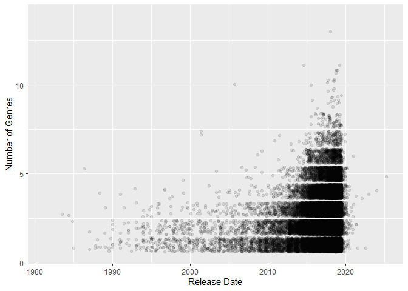
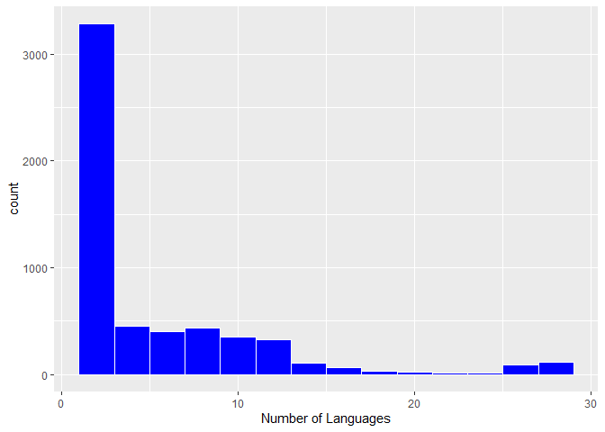

Mini Data Analysis Milestone 2
================

*To complete this milestone, you can either edit [this `.rmd`
file](https://raw.githubusercontent.com/UBC-STAT/stat545.stat.ubc.ca/master/content/mini-project/mini-project-2.Rmd)
directly. Fill in the sections that are commented out with
`<!--- start your work here--->`. When you are done, make sure to knit
to an `.md` file by changing the output in the YAML header to
`github_document`, before submitting a tagged release on canvas.*

# Welcome to the rest of your mini data analysis project!

In Milestone 1, you explored your data. and came up with research
questions. This time, we will finish up our mini data analysis and
obtain results for your data by:

- Making summary tables and graphs
- Manipulating special data types in R: factors and/or dates and times.
- Fitting a model object to your data, and extract a result.
- Reading and writing data as separate files.

We will also explore more in depth the concept of *tidy data.*

**NOTE**: The main purpose of the mini data analysis is to integrate
what you learn in class in an analysis. Although each milestone provides
a framework for you to conduct your analysis, it’s possible that you
might find the instructions too rigid for your data set. If this is the
case, you may deviate from the instructions – just make sure you’re
demonstrating a wide range of tools and techniques taught in this class.

# Instructions

**To complete this milestone**, edit [this very `.Rmd`
file](https://raw.githubusercontent.com/UBC-STAT/stat545.stat.ubc.ca/master/content/mini-project/mini-project-2.Rmd)
directly. Fill in the sections that are tagged with
`<!--- start your work here--->`.

**To submit this milestone**, make sure to knit this `.Rmd` file to an
`.md` file by changing the YAML output settings from
`output: html_document` to `output: github_document`. Commit and push
all of your work to your mini-analysis GitHub repository, and tag a
release on GitHub. Then, submit a link to your tagged release on canvas.

**Points**: This milestone is worth 50 points: 45 for your analysis, and
5 for overall reproducibility, cleanliness, and coherence of the Github
submission.

**Research Questions**: In Milestone 1, you chose two research questions
to focus on. Wherever realistic, your work in this milestone should
relate to these research questions whenever we ask for justification
behind your work. In the case that some tasks in this milestone don’t
align well with one of your research questions, feel free to discuss
your results in the context of a different research question.

# Learning Objectives

By the end of this milestone, you should:

- Understand what *tidy* data is, and how to create it using `tidyr`.
- Generate a reproducible and clear report using R Markdown.
- Manipulating special data types in R: factors and/or dates and times.
- Fitting a model object to your data, and extract a result.
- Reading and writing data as separate files.

# Setup

Begin by loading your data and the tidyverse package below:

``` r
library(datateachr) # <- might contain the data you picked!
library(tidyverse)
```

# Task 1: Process and summarize your data

From milestone 1, you should have an idea of the basic structure of your
dataset (e.g. number of rows and columns, class types, etc.). Here, we
will start investigating your data more in-depth using various data
manipulation functions.

### 1.1 (1 point)

First, write out the 4 research questions you defined in milestone 1
were. This will guide your work through milestone 2:

<!-------------------------- Start your work below ---------------------------->

1.  I want to find the relationship between player review and price
    changes in game titles
2.  In this dataset, I want to find which game developer have a tendency
    to add many achievements in their title releases. As maybe that
    gives context on the game’s replay value. *Adding to this, I want to
    find out the relationship between price change and achievement
    numbers, with the hypothesis that better games have more
    achievements, and warrant a price increase.*
3.  What genres of game that have become more or less popular over the
    few recent years? *As I’m doing this I realize the question was a
    bit vague, so I will like to find out if more recent games have more
    or less genres*
4.  How well does Mature rated game export to other countries? The
    implication of games with many languages is that it is available to
    many countries, hence easily passing censorship laws. My hypothesis
    is that the more mature games will be more localized, hence less
    language options.
    <!----------------------------------------------------------------------------->

Here, we will investigate your data using various data manipulation and
graphing functions.

### 1.2 (8 points)

Now, for each of your four research questions, choose one task from
options 1-4 (summarizing), and one other task from 4-8 (graphing). You
should have 2 tasks done for each research question (8 total). Make sure
it makes sense to do them! (e.g. don’t use a numerical variables for a
task that needs a categorical variable.). Comment on why each task helps
(or doesn’t!) answer the corresponding research question.

Ensure that the output of each operation is printed!

Also make sure that you’re using dplyr and ggplot2 rather than base R.
Outside of this project, you may find that you prefer using base R
functions for certain tasks, and that’s just fine! But part of this
project is for you to practice the tools we learned in class, which is
dplyr and ggplot2.

**Summarizing:**

1.  Compute the *range*, *mean*, and *two other summary statistics* of
    **one numerical variable** across the groups of **one categorical
    variable** from your data.
2.  Compute the number of observations for at least one of your
    categorical variables. Do not use the function `table()`!
3.  Create a categorical variable with 3 or more groups from an existing
    numerical variable. You can use this new variable in the other
    tasks! *An example: age in years into “child, teen, adult, senior”.*
4.  Compute the proportion and counts in each category of one
    categorical variable across the groups of another categorical
    variable from your data. Do not use the function `table()`!

**Graphing:**

6.  Create a graph of your choosing, make one of the axes logarithmic,
    and format the axes labels so that they are “pretty” or easier to
    read.
7.  Make a graph where it makes sense to customize the alpha
    transparency.

Using variables and/or tables you made in one of the “Summarizing”
tasks:

8.  Create a graph that has at least two geom layers.
9.  Create 3 histograms, with each histogram having different sized
    bins. Pick the “best” one and explain why it is the best.

Make sure it’s clear what research question you are doing each operation
for!

<!------------------------- Start your work below ----------------------------->

## Task 1.2

**First lets have the steam_games dataset on display for easy
reference**

``` r
head(steam_games)
```

    ## # A tibble: 6 × 21
    ##      id url     types name  desc_snippet recent_reviews all_reviews release_date
    ##   <dbl> <chr>   <chr> <chr> <chr>        <chr>          <chr>       <chr>       
    ## 1     1 https:… app   DOOM  Now include… Very Positive… Very Posit… May 12, 2016
    ## 2     2 https:… app   PLAY… PLAYERUNKNO… Mixed,(6,214)… Mixed,(836… Dec 21, 2017
    ## 3     3 https:… app   BATT… Take comman… Mixed,(166),-… Mostly Pos… Apr 24, 2018
    ## 4     4 https:… app   DayZ  The post-so… Mixed,(932),-… Mixed,(167… Dec 13, 2018
    ## 5     5 https:… app   EVE … EVE Online … Mixed,(287),-… Mostly Pos… May 6, 2003 
    ## 6     6 https:… bund… Gran… Grand Theft… NaN            NaN         NaN         
    ## # ℹ 13 more variables: developer <chr>, publisher <chr>, popular_tags <chr>,
    ## #   game_details <chr>, languages <chr>, achievements <dbl>, genre <chr>,
    ## #   game_description <chr>, mature_content <chr>, minimum_requirements <chr>,
    ## #   recommended_requirements <chr>, original_price <dbl>, discount_price <dbl>

#### Research question 1.(I want to find the relationship between player review and price changes in game titles)

**Summarizing Task \#3 “Create a categorical variable with 3 or more
groups from an existing numerical variable. You can use this new
variable in the other tasks!”**

In this task, I wanted to categorize the price change, with a more than
-50% price decrease as a “Huge Discount”, less than -50% price decrease
as “Small Discount”, less than 100% price increase as “Small Price
Increase”, and more than 100% price increase as “Huge Price Increase”

``` r
steam_games_pricechange <- steam_games %>%
  na.omit(original_price) %>%
  na.omit(discount_price) %>%
  mutate(price_change_percentage = ifelse(is.finite(((discount_price - original_price) / original_price) * 100), ((discount_price - original_price) / original_price) * 100, NA),na.rm = TRUE)
steam_games_discountlevel <-steam_games_pricechange %>%
  mutate(discount_level = case_when(price_change_percentage < -50 ~ " Huge Discount",  price_change_percentage <0 ~ "Discount", 
                                    price_change_percentage <100 ~ "Small Price Increase", 
                                    TRUE ~ "Huge Price Increase "))%>%
  select(id,name,original_price, discount_price,price_change_percentage, discount_level, all_reviews)

head(steam_games_discountlevel)
```

    ## # A tibble: 6 × 7
    ##      id name                original_price discount_price price_change_percent…¹
    ##   <dbl> <chr>                        <dbl>          <dbl>                  <dbl>
    ## 1     7 Devil May Cry 5              60.0            70.4                   17.4
    ## 2    38 Life is Strange 2             7.99           40.0                  400  
    ## 3    76 Call of Duty®: WWII           1.02          906.                 88771. 
    ## 4    95 Shadow Tactics: Bl…          40.0            13.6                  -66.0
    ## 5   154 SCUM                         20.0            28.5                   42.5
    ## 6   161 Shadow of the Tomb…           0              89.1                   NA  
    ## # ℹ abbreviated name: ¹​price_change_percentage
    ## # ℹ 2 more variables: discount_level <chr>, all_reviews <chr>

*Comment*: By categorizing the price change levels, we can see in table
form above each game’s discount level and review’s side by side.

**Graphing Task \#8 “Create a graph that has at least two geom layers”**

In this task, I will take the “discount_level” categorical variable and
make a dotplot and bar graph to see their respective counts.

``` r
discountgraph <- ggplot(steam_games_discountlevel, aes(discount_level)) + geom_dotplot() +geom_bar(alpha=0.1)
print(discountgraph)
```

    ## Bin width defaults to 1/30 of the range of the data. Pick better value with
    ## `binwidth`.

<!-- -->

*Comment*: Just making the bar graph and dot plot of the discount levels
across all the games is interesting, but it does not help me answer how
it correlates to player reviews.

#### Research question 2. (In this dataset, I want to find which game developer have a tendency to add many achievements in their title releases. As maybe that gives context on the game’s replay value. *Adding to this, I want to find out the relationship between price change and achievement numbers, with the hypothesis that better games have more achievements, and warrant a price increase.*)

**Summarizing Task \#1 “Compute the *range*, *mean*, and *two other
summary statistics* of **one numerical variable** across the groups of
**one categorical variable** from your data.”**

In this exercise, I want to find the range, mean, maximum and minimum of
achievements in each game.

``` r
mean_achievement <- mean(steam_games$achievements,na.rm = TRUE)
print(mean_achievement)
```

    ## [1] 77.23749

``` r
median_achievement <- median(steam_games$achievements,na.rm = TRUE)
print(median_achievement)
```

    ## [1] 21

``` r
minimum_achievement <- min(steam_games$achievements,na.rm = TRUE)
print(minimum_achievement)
```

    ## [1] 1

``` r
maximum_achievement <- max(steam_games$achievements,na.rm = TRUE)
print(maximum_achievement)
```

    ## [1] 9821

``` r
range_achievement <- maximum_achievement - minimum_achievement
print(range_achievement)
```

    ## [1] 9820

*Comment*: The median value does tell me somewhat the “average” number
of achievements one could expect from a normal game.The mean could not
be used as an average due to extreme outliers in some games having
\<9000 achievements. This helps us know the approximate number of
achievements we can expect per game.

**Graphing Task \#6 “Create a graph of your choosing, make one of the
axes logarithmic, and format the axes labels so that they are”pretty” or
easier to read”**

In this graph below, we will set a couple parameters, we will only look
at games with less than 1000 achievements since we can estimate those
games are outliers (based on mean achievement of 77.23 and median
achievement of 21). We will also try to eliminate games that start as
free, as they will return an “inf” value for the price change
percentage.

``` r
steam_games_achievementdiscount <-steam_games_pricechange %>%
  mutate(discount_level = case_when(price_change_percentage < -50 ~ " Huge Discount",  price_change_percentage <0 ~ "Discount", 
                                    price_change_percentage <100 ~ "Small Price Increase", 
                                    TRUE ~ "Huge Price Increase "))%>%
  select(id,name,price_change_percentage, discount_level,achievements)

cleanedsteamdiscountachivement <-na.omit(steam_games_achievementdiscount[c("achievements", "price_change_percentage")])

below1000achievement <- filter(cleanedsteamdiscountachivement, achievements <1000)


achievementgraph <- ggplot(below1000achievement, aes( achievements, price_change_percentage)) + geom_point() +scale_y_log10() +ylab("Price Change %") +xlab("Number of Achievements")
print(achievementgraph)
```

    ## Warning in self$trans$transform(x): NaNs produced

    ## Warning: Transformation introduced infinite values in continuous y-axis

    ## Warning: Removed 21 rows containing missing values (`geom_point()`).

<!-- -->

*Comment*: This graph above is to see the distribution plot whether
there is a correlation between number of achievements and price change
after release. It seems there is no clear trend observed.

#### Research question 3 (What genres of game that have become more or less popular over the few recent years? *As I’m doing this I realize the question was a bit vague, so I will like to find out if more recent games have more or less genres*)

**Summarizing Task \#2 “Compute the number of observations for at least
one of your categorical variables.”**

In this task, we will use a str_count function to count the number of
genre each game has, counting each word seperated by a comma. I also
used the lubridate function because the original release_date column is
not in a standard format and it was difficult to make the following
graph

``` r
genresteamgames<- steam_games %>% 
  mutate(genre_number = str_count(steam_games$genre, ",") +1 )%>% mutate(release_date = mdy(release_date)) %>%
  select(id, name, genre, genre_number, release_date )
```

    ## Warning: There was 1 warning in `mutate()`.
    ## ℹ In argument: `release_date = mdy(release_date)`.
    ## Caused by warning:
    ## !  4418 failed to parse.

``` r
print(genresteamgames)
```

    ## # A tibble: 40,833 × 5
    ##       id name                                    genre genre_number release_date
    ##    <dbl> <chr>                                   <chr>        <dbl> <date>      
    ##  1     1 DOOM                                    Acti…            1 2016-05-12  
    ##  2     2 PLAYERUNKNOWN'S BATTLEGROUNDS           Acti…            3 2017-12-21  
    ##  3     3 BATTLETECH                              Acti…            3 2018-04-24  
    ##  4     4 DayZ                                    Acti…            3 2018-12-13  
    ##  5     5 EVE Online                              Acti…            5 2003-05-06  
    ##  6     6 Grand Theft Auto V: Premium Online Edi… Acti…            2 NA          
    ##  7     7 Devil May Cry 5                         Acti…            1 2019-03-07  
    ##  8     8 Human: Fall Flat                        Adve…            2 2016-07-22  
    ##  9     9 They Are Billions                       Stra…            2 2017-12-12  
    ## 10    10 Warhammer: Chaosbane                    Acti…            3 2019-05-31  
    ## # ℹ 40,823 more rows

*Comment*: This task just creates a column that quantifies how many
genres each game falls under, technically we can compare this next to
the release_date in table form, but this does not make it easy to answer
the question due to the sheer number of games.

**Graphing Task \#8 “Make a graph where it makes sense to customize the
alpha transparency”**

``` r
genreanddate <- ggplot(genresteamgames, aes(release_date, genre_number)) + 
                geom_jitter(alpha = 0.1)+ylab("Number of Genres") +xlab("Release Date")

print(genreanddate)
```

    ## Warning: Removed 4793 rows containing missing values (`geom_point()`).

<!-- -->

*Comment*: This distribution graph shows that somewhere between 2005 -
2020, games appear to have more genre categories, and it suddenly drops
of after 2020. The alpha transparency setting is useful since the points
will just blob together without it.

#### Research question 4 (How well does Mature rated game export to other countries? The implication of games with many languages is that it is available to many countries, hence easily passing censorship laws. My hypothesis is that the more mature games will be more localized, hence less language options.)

**Summarizing Task \#2 “Compute the number of observations for at least
one of your categorical variables.”**

In this task, we will use a str_count function to count the number of
languages each game has.

``` r
library(stringr)

languagesteamgames<- steam_games %>% 
  mutate(language_number = str_count(steam_games$languages, ",") +1 ) %>%
  select(id, name, languages, language_number, mature_content )%>% na.omit()

print(languagesteamgames)
```

    ## # A tibble: 5,687 × 5
    ##       id name                           languages language_number mature_content
    ##    <dbl> <chr>                          <chr>               <dbl> <chr>         
    ##  1     2 PLAYERUNKNOWN'S BATTLEGROUNDS  English,…              17 Mature Conten…
    ##  2     6 Grand Theft Auto V: Premium O… English,…              12 NaN           
    ##  3     7 Devil May Cry 5                English,…              12 Mature Conten…
    ##  4    10 Warhammer: Chaosbane           English,…              13 Mature Conten…
    ##  5    13 TERA                           English                 1 Mature Conten…
    ##  6    16 Hearts of Iron IV: Mobilizati… English,…               7 NaN           
    ##  7    26 Portal Bundle                  English,…              22 NaN           
    ##  8    32 Hellblade: Senua's Sacrifice   English,…              20 Mature Conten…
    ##  9    34 Yakuza 0                       English,…               2 Mature Conten…
    ## 10    38 Life is Strange 2              English,…               8 Mature Conten…
    ## # ℹ 5,677 more rows

*Comment*: This task now creates another column that quantify the
language count of each game, so we can see in table form the games with
mature content and their corresponding number of languages. It’s the
first step to drawing a correlation as this just shows data.

**Graphing Task \#9 :“Create 3 histograms, with each histogram having
different sized bins. Pick the”best” one and explain why it is the
best.”**

``` r
histogrambin0.5 <- ggplot(languagesteamgames, aes(language_number)) +
              geom_histogram(binwidth =0.5, colour = "white", fill="blue" )+ xlab("Number of Languages")
print(histogrambin0.5)
```

<!-- -->

``` r
histogrambin1 <- ggplot(languagesteamgames, aes(language_number)) +
              geom_histogram(binwidth =1, colour = "white", fill="blue" ) + xlab("Number of Languages")
print(histogrambin1)
```

<!-- -->

``` r
histogrambin2 <- ggplot(languagesteamgames, aes(language_number)) +
              geom_histogram(binwidth =2, colour = "white", fill="blue" ) + xlab("Number of Languages")
print(histogrambin2)
```

<!-- -->

*Comment*: After seeing the 3 histograms, the best one is with a bin
width of 1, as we want to see the number of games with certain numbers
of languages, instead of grouping them together like in bin width = 2,
which makes the data more vague. This task does not help with answering
the research question as we haven’t made the mature_content variable
into something quantifiable.

<!----------------------------------------------------------------------------->

### 1.3 (2 points)

Based on the operations that you’ve completed, how much closer are you
to answering your research questions? Think about what aspects of your
research questions remain unclear. Can your research questions be
refined, now that you’ve investigated your data a bit more? Which
research questions are yielding interesting results?

<!------------------------- Write your answer here ---------------------------->

### Research question 1.(I want to find the relationship between player review and price changes in game titles)

Using the summarizing and graphing tasks, I was able to categorize each
games according to their discount or price increase groups. I haven’t
really correlated the relationship between the price changes and the
player reviews besides putting them in the table. But now that the price
change of each games is a categorical variable under “discount_level”,
there is less variation and we now need to find a way to categorize the
“player_review” column. A better research question now can be something
like: Do games with negative/very negative review more likely to
experience a huge discount?

### Research question 2. (In this dataset, I want to find which game developer have a tendency to add many achievements in their title releases. As maybe that gives context on the game’s replay value. *Adding to this, I want to find out the relationship between price change and achievement numbers, with the hypothesis that better games have more achievements, and warrant a price increase.*)

The summarizing task gives me the range, mean, median, maximum and
minimum achievements in the steam_games dataset. The median value is
valuable to know since it tells us whats the standard amount of
achievements we can expect from these games, without taking into account
extremes such as games with ~9000 achievements or those with only 1. The
graphing task of plotting number of achievements vs price change is
interesting because it disprove my hypothesis that games with more
achievements will have better price increase. The distribution plot show
no clear trend to support that. While doing my analysis, I realize the
original research question was a poor one since the “developer” column
is made of categorical variables that is unique in each row. I thought
of maybe using the arrange() function to find out which game developers
have the most or least achievements, but it didn’t fit any of the
summarizing/graphing task. So a better question would be: Would games
with more achievement tend to get more price increase?

### Research question 3 (What genres of game that have become more or less popular over the few recent years? *As I’m doing this I realize the question was a bit vague, so I will like to find out if more recent games have more or less genres*)

The summarizing task in computing the genre list into number of genres
is helpful in giving us a quantifiable variable to work with in the
graphing task of plotting the number of genres across all the games by
their release dates. Interestingly, from the graph we see that the
number of genres each game covers steadily increases over the years,
peaking at around ~2020, with some game titles reaching 8 - 13 genres.
However after 2020, it seems games are more focused, having not more
than 6 genres. It could also be that the steam_games dataset does not
have many games listed past 2020.

### Research question 4 (How well does Mature rated game export to other countries? The implication of games with many languages is that it is available to many countries, hence easily passing censorship laws. My hypothesis is that the more mature games will be more localized, hence less language options.)

Much like the previous research question, the summarizing task computes
the number of languages each game has. The graphing task, although less
helpful, shows me that around half my game only has 1 language. The next
step to answer this question would be to correlate the number of
languages to any games containing the words “Mature Content Description”
in the mature_content column.

<!----------------------------------------------------------------------------->

# Task 2: Tidy your data

In this task, we will do several exercises to reshape our data. The goal
here is to understand how to do this reshaping with the `tidyr` package.

A reminder of the definition of *tidy* data:

- Each row is an **observation**
- Each column is a **variable**
- Each cell is a **value**

### 2.1 (2 points)

Based on the definition above, can you identify if your data is tidy or
untidy? Go through all your columns, or if you have \>8 variables, just
pick 8, and explain whether the data is untidy or tidy.

<!--------------------------- Start your work below --------------------------->

The 8 variables I’m looking at are *id, types, name, release_date,
developer, original_price, discount_price, and achievements*. Based on
the definition, this data is tidy since each column is a variable, not
storing any values/information. The id, types, name, and developer
column all correlate to assigning single categorical values for a single
game. The release_date, original_price and discount_price columns also
assigns numerical variables for each games.

``` r
steamgamestidyfiltered <- steam_games %>% select(id, types, name, release_date, developer, original_price, discount_price, achievements)

print(steamgamestidyfiltered)
```

    ## # A tibble: 40,833 × 8
    ##       id types  name        release_date developer original_price discount_price
    ##    <dbl> <chr>  <chr>       <chr>        <chr>              <dbl>          <dbl>
    ##  1     1 app    DOOM        May 12, 2016 id Softw…           20.0           15.0
    ##  2     2 app    PLAYERUNKN… Dec 21, 2017 PUBG Cor…           30.0           NA  
    ##  3     3 app    BATTLETECH  Apr 24, 2018 Harebrai…           40.0           NA  
    ##  4     4 app    DayZ        Dec 13, 2018 Bohemia …           45.0           NA  
    ##  5     5 app    EVE Online  May 6, 2003  CCP                  0             NA  
    ##  6     6 bundle Grand Thef… NaN          Rockstar…           NA             35.2
    ##  7     7 app    Devil May … Mar 7, 2019  CAPCOM C…           60.0           70.4
    ##  8     8 app    Human: Fal… Jul 22, 2016 No Brake…           15.0           17.6
    ##  9     9 app    They Are B… Dec 12, 2017 Numantia…           30.0           NA  
    ## 10    10 app    Warhammer:… May 31, 2019 Eko Soft…           50.0           NA  
    ## # ℹ 40,823 more rows
    ## # ℹ 1 more variable: achievements <dbl>

<!----------------------------------------------------------------------------->

### 2.2 (4 points)

Now, if your data is tidy, untidy it! Then, tidy it back to it’s
original state.

If your data is untidy, then tidy it! Then, untidy it back to it’s
original state.

Be sure to explain your reasoning for this task. Show us the “before”
and “after”.

<!--------------------------- Start your work below --------------------------->

Since this data is tidy, we will untidy it by making the variables in
“types” column into their own columns, with their cells containing the
“achievements” values. There are 4 categories of games: *app, bundle,
sub, and NA (I assume not defined)*.

One interesting thing I saw by untidying the data is that only app-based
games have achievements on them. Bundle and sub games have no
achievement listed in the original dataset.

``` r
steamgamesuntidy <- steamgamestidyfiltered %>% 
  pivot_wider(names_from = types, values_from = achievements)
head(steamgamesuntidy)
```

    ## # A tibble: 6 × 10
    ##      id name   release_date developer original_price discount_price   app bundle
    ##   <dbl> <chr>  <chr>        <chr>              <dbl>          <dbl> <dbl>  <dbl>
    ## 1     1 DOOM   May 12, 2016 id Softw…           20.0           15.0    54     NA
    ## 2     2 PLAYE… Dec 21, 2017 PUBG Cor…           30.0           NA      37     NA
    ## 3     3 BATTL… Apr 24, 2018 Harebrai…           40.0           NA     128     NA
    ## 4     4 DayZ   Dec 13, 2018 Bohemia …           45.0           NA      NA     NA
    ## 5     5 EVE O… May 6, 2003  CCP                  0             NA      NA     NA
    ## 6     6 Grand… NaN          Rockstar…           NA             35.2    NA     NA
    ## # ℹ 2 more variables: sub <dbl>, `NA` <dbl>

To tidy it back, I’m putting the “app”, “bundle”, “sub”, and “NA”
columns under a single column “types” like the original. The values in
those 4 after-mentioned columns will be placed under a single column
labelled “achievement”.

``` r
steamgamesretidied <- steamgamesuntidy %>% 
  pivot_longer(cols = c(-id, -name, -release_date, -developer, -original_price, -discount_price ), names_to = "types",values_to = "achievements" )
head(steamgamesretidied)
```

    ## # A tibble: 6 × 8
    ##      id name          release_date developer original_price discount_price types
    ##   <dbl> <chr>         <chr>        <chr>              <dbl>          <dbl> <chr>
    ## 1     1 DOOM          May 12, 2016 id Softw…           20.0           15.0 app  
    ## 2     1 DOOM          May 12, 2016 id Softw…           20.0           15.0 bund…
    ## 3     1 DOOM          May 12, 2016 id Softw…           20.0           15.0 sub  
    ## 4     1 DOOM          May 12, 2016 id Softw…           20.0           15.0 NA   
    ## 5     2 PLAYERUNKNOW… Dec 21, 2017 PUBG Cor…           30.0           NA   app  
    ## 6     2 PLAYERUNKNOW… Dec 21, 2017 PUBG Cor…           30.0           NA   bund…
    ## # ℹ 1 more variable: achievements <dbl>

<!----------------------------------------------------------------------------->

### 2.3 (4 points)

Now, you should be more familiar with your data, and also have made
progress in answering your research questions. Based on your interest,
and your analyses, pick 2 of the 4 research questions to continue your
analysis in the remaining tasks:

<!-------------------------- Start your work below ---------------------------->

1.  Research question 1 : I want to find the relationship between player
    review and price changes in game titles
2.  Research question 4 :How well does Mature rated game export to other
    countries? The implication of games with many languages is that it
    is available to many countries, hence easily passing censorship
    laws. My hypothesis is that the more mature games will be more
    localized, hence less language options.

<!----------------------------------------------------------------------------->

Explain your decision for choosing the above two research questions.

<!--------------------------- Start your work below --------------------------->

In research question 1, I’ve already made a new column to calculate the
price change % and also categorized the discount levels based on how
large of a price increase or decrease for each game. I would like to go
further and correlate this to the all_reviews column.

In research question 4, I’ve made a column that calculated the number of
languages for each game and also know from the graphing task that about
half of my games only have 1 language. I would like now to correlate the
number of languages to games with mature content.

<!----------------------------------------------------------------------------->

Now, try to choose a version of your data that you think will be
appropriate to answer these 2 questions. Use between 4 and 8 functions
that we’ve covered so far (i.e. by filtering, cleaning, tidy’ing,
dropping irrelevant columns, etc.).

(If it makes more sense, then you can make/pick two versions of your
data, one for each research question.)

<!--------------------------- Start your work below --------------------------->

**Research question 1: I want to find the relationship between player
review and price changes in game titles**

``` r
#I will use mutate() and casewhen() to categorize the "all_review" column variable based on if they contain either "Mixed", "Mostly Positive", "Very Positive" or "Overwhelmingly Positive" keywords to 1) group the games based on their review and 2) remove the number of reviews and other irrelevant data in the "all_review" column.

steam_games_pricechange <- steam_games %>%
  na.omit(original_price) %>%
  na.omit(discount_price) %>%
  mutate(price_change_percentage = ifelse(is.finite(((discount_price - original_price) / original_price) * 100), ((discount_price - original_price) / original_price) * 100, NA),na.rm = TRUE)
steam_games_discountlevel <-steam_games_pricechange %>%
  mutate(discount_level = case_when(price_change_percentage < -50 ~ " Huge Discount",  price_change_percentage <0 ~ "Discount", 
                                    price_change_percentage <100 ~ "Small Price Increase", 
                                    TRUE ~ "Huge Price Increase "))%>%
  select(id,name,original_price, discount_price,price_change_percentage, discount_level, all_reviews)

reviewpricechange <- steam_games_discountlevel %>% 
  mutate(general_review = case_when( 
    grepl("Mixed", all_reviews) ~ "Mixed",
    grepl("Very Positive", all_reviews) ~ "Very Positive",
    grepl("Overwhelmingly Positive", all_reviews) ~ "Overwhelmingly Positive",
    grepl("Mostly Positive", all_reviews) ~ "Mostly Positive")) %>% na.omit() 


#We will keep our observation with games that does not exceed 500% in price increase, as this eliminates games that is released at a very low price originally. I also ordered the x-axis from gradually better reviews for ease of viewing

below500pricechange <- filter(reviewpricechange, price_change_percentage <500)
x_axis_order <- c("Mixed", "Mostly Positive", "Very Positive", "Overwhelmingly Positive")
below500pricechange$general_review <- factor(below500pricechange$general_review, level = x_axis_order )
reviewpricechangeplot <- ggplot(below500pricechange, aes(general_review, price_change_percentage))+geom_point(aes(color = general_review ),size = 2, alpha =0.5)+ylab("Price Change %") +xlab("Review Rating")
print(reviewpricechangeplot)
```

<!-- -->

My distribution plot above shows that games with better reviews tend to
have higher price increases. We see that games with “Mixed” reviews have
a price discount close to 100% and a price increase no greater than
200%. Meanwhile, games with “Very Positive” reviews can have a price
increase nearing 500%.

**Research question 4: How well does Mature rated game export to other
countries?**

``` r
#I'm taking this code below from task 1.2
languagesteamgames<- steam_games %>% 
  mutate(language_number = str_count(steam_games$languages, ",") +1 ) %>%
  select(id, name, languages, language_number, mature_content )%>% na.omit()
#This code here is to get rid of "NaN" entries in the mature_content column. Basically to weed out the games without mature content
maturecontent_and_language <- languagesteamgames %>% filter(mature_content != "NaN")

mature_language_plot <- ggplot(maturecontent_and_language, aes(language_number)) + 
                geom_histogram(binwidth =1, colour = "white", fill="green")+ylab("Mature Games") +xlab("Number of Languages")
print(mature_language_plot)
```

<!-- -->

My graph in “mature_language_plot” proves my hypothesis correct, in that
mature content games don’t typically have many languages, implying it
only sells in the country it originates in. Seeing it in table form from
the dataset “maturecontent_and_language”, we see most of these mature
games only have 1 language in English.

<!----------------------------------------------------------------------------->

# Task 3: Modelling

## 3.0 (no points)

Pick a research question from 1.2, and pick a variable of interest
(we’ll call it “Y”) that’s relevant to the research question. Indicate
these.

<!-------------------------- Start your work below ---------------------------->

**Research Question**: Research question 2. (In this dataset, I want to
find which game developer have a tendency to add many achievements in
their title releases. As maybe that gives context on the game’s replay
value. *Adding to this, I want to find out the relationship between
price change and achievement numbers, with the hypothesis that better
games have more achievements, and warrant a price increase.*)

**Variable of interest**: Achievements

<!----------------------------------------------------------------------------->

## 3.1 (3 points)

Fit a model or run a hypothesis test that provides insight on this
variable with respect to the research question. Store the model object
as a variable, and print its output to screen. We’ll omit having to
justify your choice, because we don’t expect you to know about model
specifics in STAT 545.

- **Note**: It’s OK if you don’t know how these models/tests work. Here
  are some examples of things you can do here, but the sky’s the limit.

  - You could fit a model that makes predictions on Y using another
    variable, by using the `lm()` function.
  - You could test whether the mean of Y equals 0 using `t.test()`, or
    maybe the mean across two groups are different using `t.test()`, or
    maybe the mean across multiple groups are different using `anova()`
    (you may have to pivot your data for the latter two).
  - You could use `lm()` to test for significance of regression
    coefficients.

<!-------------------------- Start your work below ---------------------------->

``` r
#This fits a linear regression model from my graphing task in research question 2, when I wanted to see the correlation between number of achievements and price change. The price change data was calculated from original_price and discount_price columns in the original steam_games dataset.

modelfit <- lm(achievements ~ price_change_percentage,data = below1000achievement )
print(modelfit)
```

    ## 
    ## Call:
    ## lm(formula = achievements ~ price_change_percentage, data = below1000achievement)
    ## 
    ## Coefficients:
    ##             (Intercept)  price_change_percentage  
    ##              48.6524248               -0.0001345

<!----------------------------------------------------------------------------->

## 3.2 (3 points)

Produce something relevant from your fitted model: either predictions on
Y, or a single value like a regression coefficient or a p-value.

- Be sure to indicate in writing what you chose to produce.
- Your code should either output a tibble (in which case you should
  indicate the column that contains the thing you’re looking for), or
  the thing you’re looking for itself.
- Obtain your results using the `broom` package if possible. If your
  model is not compatible with the broom function you’re needing, then
  you can obtain your results by some other means, but first indicate
  which broom function is not compatible.

<!-------------------------- Start your work below ---------------------------->

From the above linear regression model, I will try to extract the
residual degree of freedom.

``` r
lookmodelfit <- unclass(modelfit)
names(lookmodelfit)
```

    ##  [1] "coefficients"  "residuals"     "effects"       "rank"         
    ##  [5] "fitted.values" "assign"        "qr"            "df.residual"  
    ##  [9] "xlevels"       "call"          "terms"         "model"

``` r
lookmodelfit$df.residual
```

    ## [1] 72

I did try the broom functions “tidy”, “augment” and “glance”, however it
does not seem to be compatible with the data.

<!----------------------------------------------------------------------------->

# Task 4: Reading and writing data

Get set up for this exercise by making a folder called `output` in the
top level of your project folder / repository. You’ll be saving things
there.

## 4.1 (3 points)

Take a summary table that you made from Task 1, and write it as a csv
file in your `output` folder. Use the `here::here()` function.

- **Robustness criteria**: You should be able to move your Mini Project
  repository / project folder to some other location on your computer,
  or move this very Rmd file to another location within your project
  repository / folder, and your code should still work.
- **Reproducibility criteria**: You should be able to delete the csv
  file, and remake it simply by knitting this Rmd file.

<!-------------------------- Start your work below ---------------------------->

The summary table I will be using is “steam_games_discountlevel” from
Task 1.

``` r
library(here)
```

    ## here() starts at C:/Users/User/Desktop/STAT 545/MDA/mda-mvhalim

``` r
write.csv(steam_games_discountlevel, here::here("output", "steam_games_discountlevel.csv"))
```

<!----------------------------------------------------------------------------->

## 4.2 (3 points)

Write your model object from Task 3 to an R binary file (an RDS), and
load it again. Be sure to save the binary file in your `output` folder.
Use the functions `saveRDS()` and `readRDS()`.

- The same robustness and reproducibility criteria as in 4.1 apply here.

<!-------------------------- Start your work below ---------------------------->

``` r
modelfit <- lm(achievements ~ price_change_percentage,data = below1000achievement )

saveRDS(modelfit, file= here("output", "modelfit.rds"))

modelfitread <- readRDS(here("output","modelfit.rds"))
modelfitread
```

    ## 
    ## Call:
    ## lm(formula = achievements ~ price_change_percentage, data = below1000achievement)
    ## 
    ## Coefficients:
    ##             (Intercept)  price_change_percentage  
    ##              48.6524248               -0.0001345

<!----------------------------------------------------------------------------->

# Overall Reproducibility/Cleanliness/Coherence Checklist

Here are the criteria we’re looking for.

## Coherence (0.5 points)

The document should read sensibly from top to bottom, with no major
continuity errors.

The README file should still satisfy the criteria from the last
milestone, i.e. it has been updated to match the changes to the
repository made in this milestone.

## File and folder structure (1 points)

You should have at least three folders in the top level of your
repository: one for each milestone, and one output folder. If there are
any other folders, these are explained in the main README.

Each milestone document is contained in its respective folder, and
nowhere else.

Every level-1 folder (that is, the ones stored in the top level, like
“Milestone1” and “output”) has a `README` file, explaining in a sentence
or two what is in the folder, in plain language (it’s enough to say
something like “This folder contains the source for Milestone 1”).

## Output (1 point)

All output is recent and relevant:

- All Rmd files have been `knit`ted to their output md files.
- All knitted md files are viewable without errors on Github. Examples
  of errors: Missing plots, “Sorry about that, but we can’t show files
  that are this big right now” messages, error messages from broken R
  code
- All of these output files are up-to-date – that is, they haven’t
  fallen behind after the source (Rmd) files have been updated.
- There should be no relic output files. For example, if you were
  knitting an Rmd to html, but then changed the output to be only a
  markdown file, then the html file is a relic and should be deleted.

Our recommendation: delete all output files, and re-knit each
milestone’s Rmd file, so that everything is up to date and relevant.

## Tagged release (0.5 point)

You’ve tagged a release for Milestone 2.

### Attribution

Thanks to Victor Yuan for mostly putting this together.
